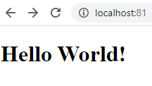

## Project Overview

For this project you will be creating a fresh repository - the link is in Pilot under Content - Projects - Project 5. This is the repo you will be using for this project.

You will notice that each part has "Milestone" labels and dates. This project is not due until 4/22. Completion of each milestone **by the date specificied for the milestone** will get you 1 pt of extra credit per milestone date met. To qualify, you must submit your project to the Dropbox for Project 5 in Pilot.

## Part 1 - Dockerize it

### Documentation

- how you installed docker + dependencies (WSL2, for example)
    - I went to the website "https://www.docker.com/products/docker-desktop/" and downloaded Docker Desktop for Windows. In a previous class, I already made my ubuntu instance viable with WSL2. I made sure inside the settings of Docker Desktop that "Use the WSL 2 based engine (Windows Home can only run the WSL 2 backend)" was checked off and it was.
- how to build the container
    - Inside my repo, I made a Dockerfile with the following contents:
        - FROM ubuntu/apache2:latest

          RUN rm /var/www/html/index.html

          COPY website /var/www/html/

          EXPOSE 80

          CMD apachectl -D FOREGROUND
    - After making my Dockerfile, I ran the command "docker build -t my-apache2 ."
- how to run the container
    - I ran the container using the command "docker run -dit --name my-running-app -p 81:80 my-apache2"
- how to view the project (open a browser...go to ip and port...)
    - I went to my browser and typed in "http://localhost:81" and got this result:
    

## Part 2 - GitHub Actions and DockerHub

- Create DockerHub public repo
  - You create an account on Dockerhub. Once inside, navigate to the Repositories section and click on "Create Repository." Name your repository and make sure "Public" is checked off then hit "Create".

- Allow DockerHub authentication via CLI using Dockhub credentials
  - Navigate to your account settings and click on "Security'. Once there, click on "New Access Token". Name the token (in my case, I named it "dockerhub-rwd") and put read, write, and delete on it. Once the token is created, save the token's contents in either Microsoft Word or Notepad just in case.

- Configure GitHub Secrets
  - what credentials are needed - DockerHub credentials (do not state your credentials)
    - You need to have the docker key that you saved in either Microsft Word or Notepad.
  - set secrets and secret names
    - Log into your Github account and find "Settings" and look on the left hand side for "Secrets". Click on "Action" and create two secrets by clicking on "New Repository Secret", one for your user name and one for your password. In my case, I named them "DOCKER_USERNAME" and "DOCKER_TOKEN".

- Configure GitHub Workflow
  - variables to change (repository, etc.)- Create DockerHub public repo
  - process to create
    - Once the file is created, push the file to your Github account and go to "Actions" to see if it was created successfully.
  - The following is the contents of my yaml file:
name: my-apache2
on:
  push:
    branches: [main]
  pull_request:
    branches: [main]
env:
  DOCKER_HUB_REPO: my-apache2
jobs:
  build_and_push:
    name: Build docker image and push to Docker Hub
    runs-on: ubuntu-latest
    steps:
      - 
        name: Checkout repo to runner
        uses: actions/checkout@v2
      - 
        name: Set up Docker Buildx
        uses: docker/setup-buildx-action@v1
      - 
        name: Login to DockerHub
        uses: docker/login-action@v1 
        with:
          username: ${{ secrets.DOCKER_USERNAME }}
          password: ${{ secrets.DOCKER_TOKEN }}
      - 
        name: Build and push 
        uses: docker/build-push-action@v2
        with:
          context: .
          file: ./Dockerfile
          push: true
          tags: ${{ secrets.DOCKER_USERNAME }}/${{ env.DOCKER_HUB_REPO }}:latest

